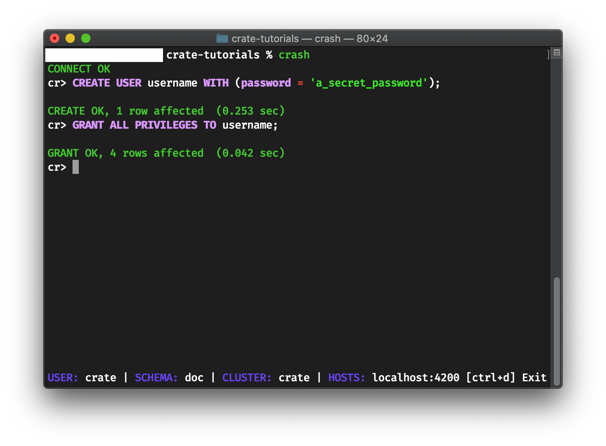

.. _create-user:

===========
Create user
===========

------------
Introduction
------------

This part of the documentation sheds some light on the topics of `user
management`_ and `privileges`_.

CrateDB ships with a superuser account called "``crate``", which has the
privileges to perform any action. However, with the default configuration, this
superuser can only access CreateDB from the local machine CrateDB has been
installed on. If you are trying to connect from another machine, you are
prompted to enter a username and password.

In order to create a user that can be used to authenticate from a remote
machine, first `install Crash`_ (or `another client`_) on the same machine you
installed CrateDB on. Then, connect to CrateDB running on ``localhost``.

While you can also perform the steps outlined below within `Admin UI`_ itself,
the walkthrough will outline how to do it using the CrateDB Shell (Crash_) on
the command line.

-------
Details
-------

Invoke Crash within the terminal of your choice.

.. code-block:: console

   sh$ crash

Add your first user with a secure password to the database:

.. code-block:: psql

   cr> CREATE USER username WITH (password = 'a_secret_password');

Grant all privileges to the newly created user:

.. code-block:: psql

   cr> GRANT ALL PRIVILEGES TO username;

Now try navigating to the `Admin UI`_ in your browser. In the URL below, please
replace ``cratedb.example.org`` with the host name or IP address of the machine
CreateDB is running on and sign in with your newly created user account::

   http://cratedb.example.org:4200/

You should see something like this:

.. image:: _assets/img/first-use/admin-ui.png

After creating the user and granting all privileges, you should be able to
continue with :ref:`the guided tour <use>` connecting to CrateDB from a remote
machine.

.. _Admin UI: https://crate.io/docs/clients/admin-ui/en/latest/
.. _another client: https://crate.io/docs/crate/clients-tools/en/latest/
.. _configuration: https://crate.io/docs/crate/reference/en/latest/config/index.html
.. _Crash: https://crate.io/docs/clients/crash
.. _install Crash: https://crate.io/docs/clients/crash/en/latest/getting-started.html#installation
.. _privileges: https://crate.io/docs/crate/reference/en/latest/admin/privileges.html
.. _user management: https://crate.io/docs/crate/reference/en/latest/admin/user-management.html
