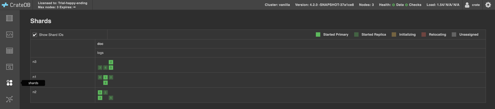

===========
Downscaling
===========

In this tutorial we:

- Create a Vanilla cluster.
- Add some data to it.
- Downscale it to a single node cluster.

Starting a Vanilla cluster
--------------------------

A Vanilla cluster is a three node cluster that runs on a single host. Each of the
nodes share the file system and operating system scheduler of the host, to form a
cluster. This rig provides parallel processing power on large scale data, when you
only have one host, and this comes at the cost increased latency in writes.

Proceed:

1. *~/.../crate-tutorials/scripts/downscaling* should contain:

   - *update-dist*: script to install **CrateDB**.
   - *dist*: **CrateDB** distributions.
   - *crate*: a symlink to a particular distribution in the *dist* folder (not
     the **CrateDB**, executable script), where you will also find a *crate-clone*
     git repository.
   - *conf*: **CrateDB** configurations, each node in the cluster has a folder
     in there, with the *crate.yml* and *log4j2.properties*.
   - *data*: **CrateDB** the nodes will persist their data under *data/ni/nodes/0*.
   - *repo*: **CrateDB** repo, for snapshotting.
   - *start-node*: script to start **CrateDB** with a given configuration.
   - *detach-node*: script to detach a node from the cluster.
   - *bootstrap-node*: script to bootstrap a node to form a new cluster. Which
     means, recreating its cluster state so that it may be started on its own
     forming a new cluster that has access to the data in the previous.
   - *data.py*: script produce dummy data.

2. Run *./update-dist*

   - This will install the latest, unreleased, **CrateDB** under *dist/*, creating
     a link *./crate -> dist/crate..*.
   - Assumed **git**, **java 11** or later, **python3** and a **terminal** are
     available to you, and you have an account in GitHub_.

3. The configuration for the Vanilla cluster:

    - *~/.../crate-tutorials/scripts/downscaling/conf/n1/crate.yml*
    - *~/.../crate-tutorials/scripts/downscaling/conf/n2/crate.yml*
    - *~/.../crate-tutorials/scripts/downscaling/conf/n3/crate.yml*
    - *~/.../crate-tutorials/scripts/downscaling/conf/log4j2.properties*

4. Run *./startnode* in three different terminals

   - *./startnode n1*
   - *./startnode n2*
   - *./startnode n3*

   Which will form the Vanilla cluster, electing a master. You can
   interact with the Vanilla cluster by opening a browser and pointing
   it to *http://localhost:4200*, *CrateDB*'s `Admin UI`_.

Adding some data to the cluster
-------------------------------

Proceed:

1. Produce a CSV_ file containing 3600 rows of log data (1 hour's worth of logs @1Hz):

  ::

    ./data.py > logs.csv

2. In the `Admin UI`_:

  ::

    CREATE TABLE logs (log_time timestamp NOT NULL,
                       client_ip ip NOT NULL,
                       request string NOT NULL,
                       status_code short NOT NULL,
                       object_size long NOT NULL);

     COPY logs FROM 'file:///.../crate-tutorials/scripts/downscaling/logs.csv';
     REFRESH TABLE logs;
     select * from logs order by log_time limit 10800;

  The three nodes perform the copy, so we are expecting to see 3600 * 3 rows, with
  what looks like "repeated" data. Because we did not define a primary key, **CrateDB**
  created the default *_id* primary key, which is a unique hash (varchar), so in effect,
  because each row has a unique id, they are all inserted.

Exploring the Data
------------------

Using the `Admin UI`_, shards view on the left:

We can see the three nodes, each having a number of shards, specifically:

    +-------+---+---+---+---+---+---+
    | Shard | 0 | 1 | 2 | 3 | 4 | 5 |
    +=======+===+===+===+===+===+===+
    |  n1   | . | . | . |   | . |   |
    +-------+---+---+---+---+---+---+
    |  n2   | . | . |   | . |   | . |
    +-------+---+---+---+---+---+---+
    |  n3   |   |   | . | . | . | . |
    +-------+---+---+---+---+---+---+

Thus in this cluster setup, one node can crash, yet the data in the cluster
will still remain fully available because any two nodes have access to all
the shards, when they work together to fulfill query requests. A SQL table
is a composite of shards, six in our case. When a query is executed, the
planner will define steps for accessing all the shards of the table.
By adding nodes to the cluster, the data is spread over more nodes, so that
the computing is parallelized.

Having a look at the setup for table *logs*:

::

  SHOW CREATE TABLE logs;

Will return:

::

  CREATE TABLE IF NOT EXISTS "doc"."logs" (
     "log_time" TIMESTAMP WITH TIME ZONE NOT NULL,
     "client_ip" IP NOT NULL,
     "request" TEXT NOT NULL,
     "status_code" SMALLINT NOT NULL,
     "object_size" BIGINT NOT NULL
  )
  CLUSTERED INTO 6 SHARDS
  WITH (
     ...
     number_of_replicas = '0-1',
     ...
  )

We have a default min number of replicas of zero, and a max of one for each
of our six shards. A replica is simply a copy or a shard.

Downscaling (by means of replicas)
----------------------------------

Downscaling by means of replicas is achieved by making sure the surviving nodes
of the cluster have access to all the shards, even when the other nodes are missing.

1. We need to ensure that the number of replicas matches the number of nodes:

::

  ALTER TABLE logs SET (number_of_replicas = '1-all');

In the `Admin UI`_, we can follow the progress of replication.

2. After replication is completed, we can take down all the nodes in the cluster
   (*ctrl^C* in the terminal).

3. Run *./detach-node ni*, where i in [2,3], to detach **n2** and **n3** from the cluster.
   We will let **n1** form a new cluster all by itself, with access to the original data.

4. Change **n1**'s configuration *crate.yml*. The best practice is to select the node
   that was master, as then we know it has the latest version of the cluster state. For
   our tutorial, we are running in a single host so cluster state is more or less
   guaranteed to be consistent across nodes, but, in principle, the cluster could be
   running across multiple hosts, and then we would want the master node to become the
   new single node cluster:

   ::

     cluster.name: simple   # don't need to change this
     node.name: n1
     stats.service.interval: 0
     network.host: _local_
     node.max_local_storage_nodes: 1

     http.cors.enabled: true
     http.cors.allow-origin: "*"

     transport.tcp.port: 4301
     #gateway.expected_nodes: 3
     #gateway.recover_after_nodes: 2
     #discovery.seed_hosts:
     #  - 127.0.0.1:4301
     #  - 127.0.0.1:4302
     #cluster.initial_master_nodes:
     #  - 127.0.0.1:4301
     #  - 127.0.0.1:4302

5. Run *./bootstrap-node n1* to let **n1** join a new cluster when it starts.

6. Run *./start-node n1*.
   Panic not, the cluster state is *[YELLOW]*, we sort that out with:

   ::

     ALTER TABLE logs SET (number_of_replicas = '0-1');

Further reading: crate-node_.

.. _GitHub: https://github.com/crate/crate.git
.. _`Admin UI`: http://localhost:4200
.. _crate-node: https://crate.io/docs/crate/reference/en/latest/cli-tools.html#cli-crate-node
.. _CSV: https://en.wikipedia.org/wiki/Comma-separated_values
.. _crate-node: https://crate.io/docs/crate/guide/en/latest/best-practices/crate-node.html