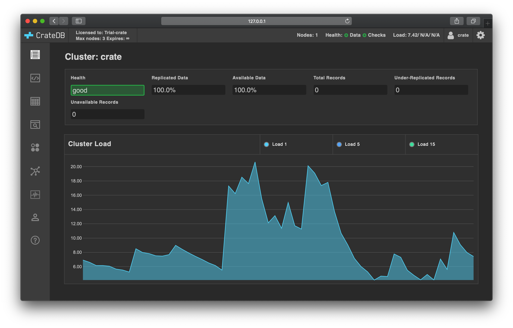

.. _use:

=========
First use
=========

Once CrateDB is :ref:`installed and running <install>`, you can start to
interact with the database for the first time.

.. rubric:: Table of contents

.. contents::
   :local:

.. _use-admin-ui:

Introducing the Admin UI
========================

CrateDB ships with a web administration user interface (UI), or `Admin UI`_ for
short.

The CrateDB admin UI runs on every CrateDB node, and you can use it to inspect
and interact with the whole CrateDB cluster in a number of ways.

We will use the admin UI throughout this section.

Access the admin UI in your browser using a URL like this::

  http://localhost:4200/

If CrateDB is not running locally, replace ``localhost`` with the hostname
CrateDB is running on.

You should see something like this:

.. SEEALSO::

   `The CrateDB Admin UI documentation`_

.. _use-more-tutorials:

Follow more tutorials to get a sense of CrateDB
===============================================

If you want to get a feel for using CrateDB to work with time series data, you
are going to need a source of time series data. Fortunately, there are many
ways to generate time series data by sampling the systems running on your local
computer.

The :ref:`next collection of tutorials <gen-ts>` shows how to generate mock
time series data about the International Space Station (ISS) and write it to
CrateDB using the client of your choice.

.. _use-start-building:

Start building with CrateDB clients and tools
=============================================

If you'd like to skip the tutorials and start building with CrateDB, you can
find `a list of available CrateDB clients and tools`_ in a different section of
the documentation.

.. _use-dive-in:

Dive in to CrateDB
==================

Check out the `How-to Guides`_ for goal oriented topics. Alternatively, check
out the `CrateDB Reference`_ for a complete dip-in-and-dip-out reference manual.

.. _a list of available CrateDB clients and tools: https://crate.io/docs/crate/clients-tools/en/latest/
.. _Admin UI: https://crate.io/docs/clients/admin-ui/en/latest/
.. _aggregation: https://crate.io/docs/stable/sql/aggregation.html
.. _client tools: https://crate.io/a/category/client-tools/
.. _Crash: https://crate.io/docs/clients/crash/en/latest/
.. _CrateDB Reference: https://crate.io/docs/crate/reference/
.. _fulltext search: https://crate.io/docs/crate/reference/en/latest/general/dql/fulltext.html
.. _geospatial: https://crate.io/docs/stable/sql/data_types.html#geo-point
.. _How-to Guides: https://crate.io/docs/crate/howtos/
.. _HTTP endpoint: https://crate.io/docs/crate/reference/en/latest/interfaces/http.html
.. _HTTPie: https://httpie.org/
.. _install Crash: https://crate.io/docs/clients/crash/en/latest/getting-started.html#install
.. _object: https://crate.io/docs/crate/reference/en/latest/general/ddl/data-types.html#object
.. _regular SQL: https://crate.io/docs/crate/reference/en/latest/appendices/sql-compliance.html
.. _scalar: https://crate.io/docs/stable/sql/scalar.html
.. _schema: https://crate.io/docs/crate/reference/en/latest/general/ddl/create-table.html#schemas
.. _The CrateDB Admin UI documentation: `Admin UI`_
.. _the CrateDB query reference: https://crate.io/docs/crate/reference/en/latest/general/dql/index.html
