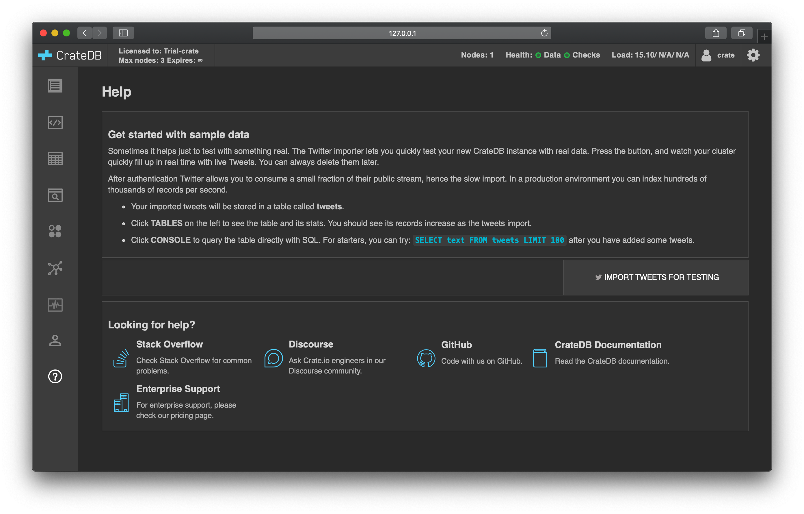
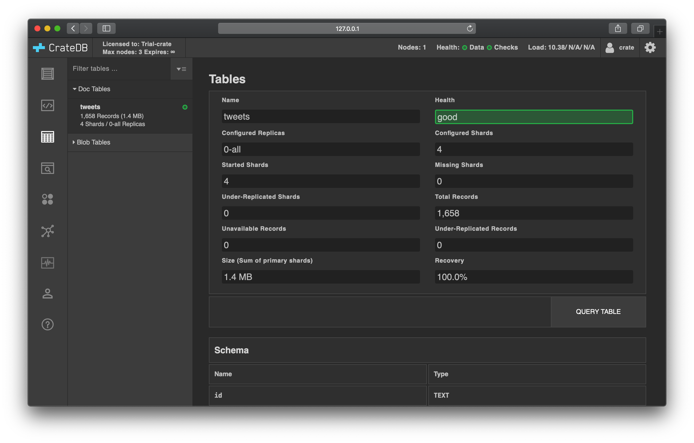
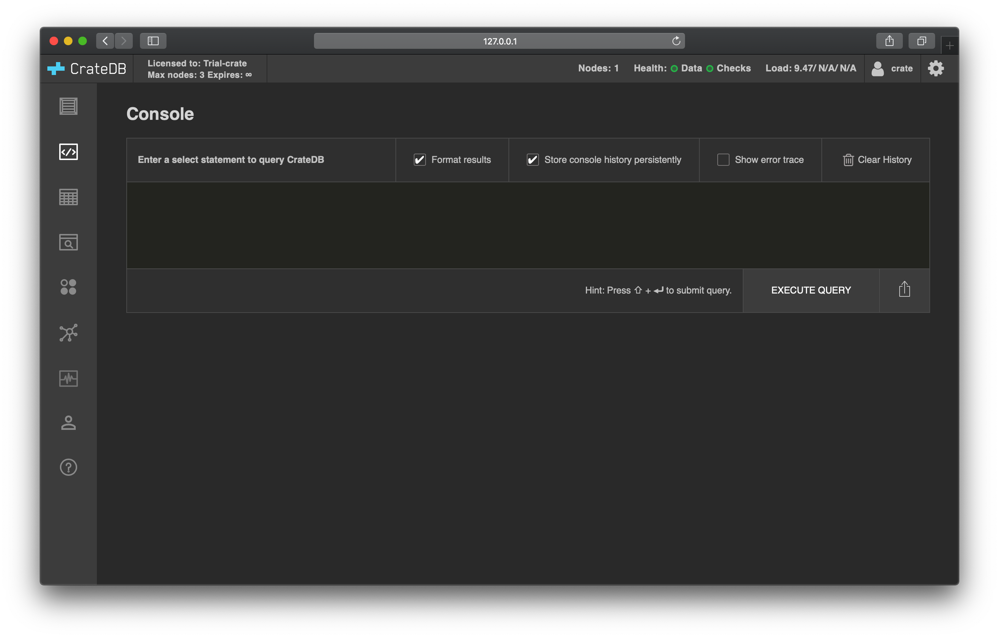
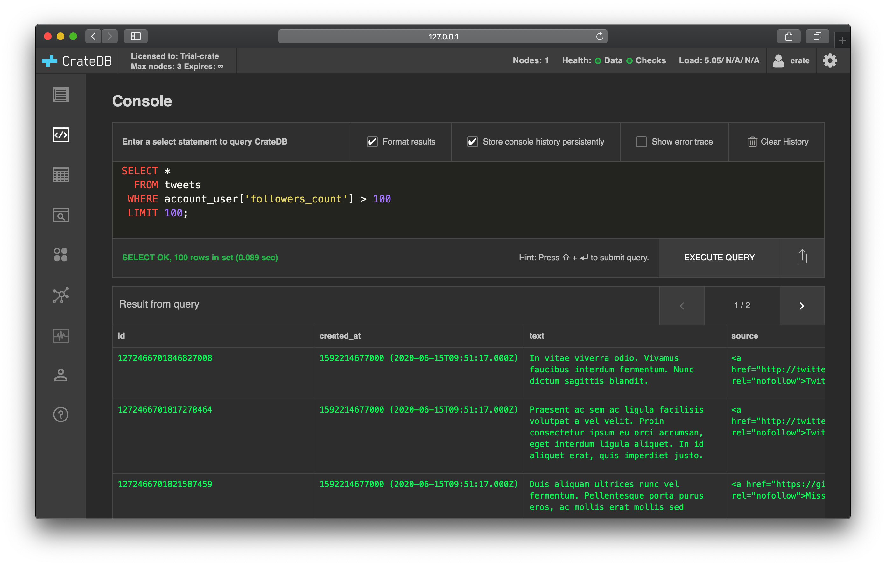

.. _first-use:

=========
First use
=========

Once CrateDB is :ref:`installed and running <install-run>`, you can start to
interact with the database for the first time. Follow this tutorial for a brief
guided tour.

.. rubric:: Table of contents

.. contents::
   :local:

.. _admin-ui:

Admin UI
========

CrateDB ships with a web administration user interface (UI), or `admin UI`_ for
short.

The CrateDB admin UI runs on every CrateDB node, and you can use it to inspect
and interact with the whole CrateDB cluster in a number of ways.

We will use the admin UI throughout this section.

Access the admin UI in your browser using a URL like this::

  http://localhost:4200/

If CrateDB is not running locally, replace ``localhost`` with the hostname
CrateDB is running on.

You should see something like this:

.. image:: _assets/img/first-use/admin-ui.png

.. _import:

Import some tweets
------------------

In the admin UI, select the *Help* tab (question mark icon) from the left-hand
navigation menu.

You should see something like this:

Select *IMPORT TWEETS FOR TESTING* and follow the instructions to authenticate
your Twitter account.

.. TIP::

   Don't worry. This isn’t going to post anything on your behalf. All this does
   is import a selection of recent public tweets on Twitter.

Leave this running and stop it when you have enough tweets. Aim for at least
few thousand.

When you're done, select the *Tables* icon from the left-hand navigation.

You should see something like this:

Query your tweets
-----------------

CrateDB uses `regular SQL`_ for queries.

One of the easiest ways to query CrateDB is with the query console in the
CrateDB admin UI.

:ref:`Open up the admin UI <admin-ui>`.

Select the *Console* tab from the left-hand navigation menu.

You should see something like this:

In the previous document, we imported some tweets from the public Twitter
timeline.

If you want know more about the ``tweets`` table, select the *Tables* tab from
the left-hand navigation menu. This screen will show you the table `schema`_.

For an example query, why don't we filter those tweets so that we're only
looking at tweets from people with more than 100 followers. We can do that with
a query like so:

.. code-block:: psql

    SELECT *
      FROM tweets
     WHERE account_user['followers_count'] > 100
     LIMIT 100;

The ``tweets`` table has a column named ``account_user``. The ``account_user``
is an `object`_, and can be queried into by specifying object attributes. In
the query above, we're matching rows where the ``followers_count`` attribute of
this object is more than ``100``.

Type this query into the admin UI query console. Then select *EXECUTE QUERY*.

You should see something like this:

CrateDB's SQL support includes distributed `aggregation`_, `scalar`_ functions
and `geospatial`_ support for more complex queries and data analysis. CrateDB
also comes with `fulltext search`_.

.. SEEALSO::

   Consult `the CrateDB query reference`_ for documentation on the full range
   of query capabilities.

Crash
=====

The CrateDB shell (aka `Crash`_) is a command-line shell.

First, you must `install Crash`_.

Then, you can start the shell like so:

.. code-block:: console

   sh$ crash

This will automatically connect to CrateDB running on ``localhost``.

From here, you can execute queries against CrateDB by typing them and hitting
:kbd:`Enter`.

Let's try something new.

Type out the following query:

.. code-block:: psql

     SELECT account_user['followers_count']
       FROM tweets
   ORDER BY account_user['followers_count'] DESC
      LIMIT 10;

As you type, you may notice that Crash comes with autocompletion.

Here, we're ordering by follower count from highest to lowest, and then
selecting the top 10 values.

Hit :kbd:`Enter`.

You should see something like this:

.. code-block:: text

   +---------------------------------+
   | account_user['followers_count'] |
   +---------------------------------+
   |                         1416583 |
   |                         1076527 |
   |                         1025614 |
   |                          886577 |
   |                          854054 |
   |                          818439 |
   |                          795778 |
   |                          761014 |
   |                          740071 |
   |                          673962 |
   +---------------------------------+
   SELECT 10 rows in set (0.003 sec)

The CrateDB HTTP endpoint
=========================

CrateDB provides a `HTTP endpoint`_.

.. TIP::

   If you're not familiar with HTTP APIs, feel free to skip this section.

Let's run another query:

.. code-block:: psql

   SELECT COUNT(*) FROM tweets

This time, all we want to know is how many tweets we have.

Using `HTTPie`_, you can run this query against CrateDB listening on
``localhost:4200``, like so:

.. code-block:: console

   sh$ http localhost:4200/_sql stmt="SELECT COUNT(*) FROM tweets"

CrateDB will respond using ``JSON``. You should see something like this:

.. _JSON: https://www.json.org/

.. code-block:: text

   HTTP/1.1 200 OK
   content-length: 71
   content-type: application/json; charset=UTF-8

   {
       "cols": [
           "count(*)"
       ],
       "duration": 11.847271,
       "rowcount": 1,
       "rows": [
           [
               3879
           ]
       ]
   }

In this example, we have a single row with a single column: ``3879``.

Next steps
==========

Start building with `CrateDB clients and tools`_.

.. SEEALSO::

    :ref:`Generate time series data <gen-ts>` (tutorials for multiple
    languages)

.. _admin UI: https://crate.io/docs/clients/admin-ui/en/latest/
.. _aggregation: https://crate.io/docs/stable/sql/aggregation.html
.. _client tools: https://crate.io/a/category/client-tools/
.. _Crash: https://crate.io/docs/clients/crash/en/latest/
.. _CrateDB clients and tools: https://crate.io/docs/crate/clients-tools/en/latest/
.. _fulltext search: https://crate.io/docs/crate/reference/en/latest/general/dql/fulltext.html
.. _geospatial: https://crate.io/docs/stable/sql/data_types.html#geo-point
.. _HTTP endpoint: https://crate.io/docs/crate/reference/en/latest/interfaces/http.html
.. _HTTPie: https://httpie.org/
.. _install Crash: https://crate.io/docs/clients/crash/en/latest/getting-started.html#install
.. _object: https://crate.io/docs/crate/reference/en/latest/general/ddl/data-types.html#object
.. _regular SQL: https://crate.io/docs/crate/reference/en/latest/appendices/sql-compliance.html
.. _scalar: https://crate.io/docs/stable/sql/scalar.html
.. _schema: https://crate.io/docs/crate/reference/en/latest/general/ddl/create-table.html#schemas
.. _the CrateDB query reference: https://crate.io/docs/crate/reference/en/latest/general/dql/index.html
