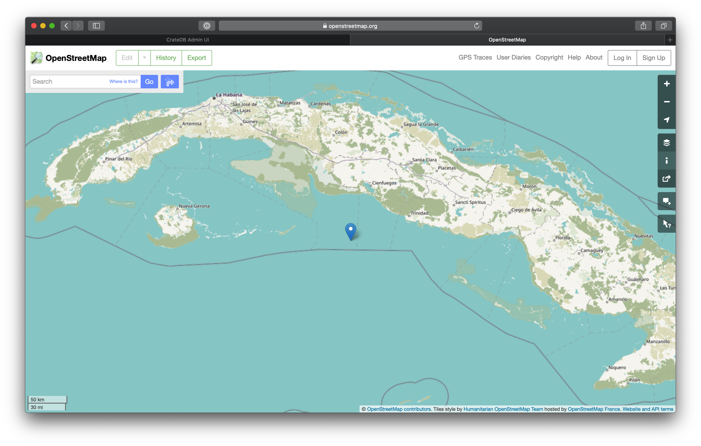

.. _gen-ts-go:

==================================
Generate time series data using Go
==================================

This tutorial will show you how to generate some :ref:`experimental time 
series data <gen-ts>` from information about the `International Space Station`_
using `Go`_.

.. SEEALSO::

    :ref:`gen-ts`

.. rubric:: Table of contents

.. contents::
   :local:

Prerequisites
=============

You must have CrateDB :ref:`installed and running <install-run>`.

Make sure you're running an up-to-date version of `Go`_. We recommend 
Go 1.11 or higher since we will be making use of `modules`_. 

Most of this tutorial is designed to be run as a local Go project using Go 
tooling since the `compilation`_ unit is the package and not a single line.

To begin, create a project directory and navigate into it:

.. code-block:: console

    $ mkdir time-series-go
    $ cd time-series-go

Next, choose a module path and create a `go.mod` file that declares it:

.. code-block:: console

    $ go mod init example.com/time-series-go

You should see a `go.mod` file in the current directory with contents similar to:

.. code-block:: console

    module example.com/time-series-go

    go 1.14

Next, create a file named `main.go` in the same directory:

.. code-block:: console

   $ touch main.go

Open up your favorite code editor. We will be editing this file a lot!

Get ISS telemetry data
======================

You can get telemetry data from `Open Notify`_, a third-party service that
provides a simple API to consume data from NASA (specifically, the current
location of the International Space Station). The endpoint for this data is
`<http://api.open-notify.org/iss-now.json>`_.

In your `main.go` file, declare the main package at the top (to tell the 
compiler that our program is an executable), import some packages from the 
`standard library`_ that will be used in this tutorial and declare a main 
function which will be the entry point of our executable program:

.. code-block:: js

    package main

    import (
        "encoding/json"
        "fmt"
        "io/ioutil"
        "log"
        "net/http"
    )

    func main() {

    }

Then, look at the JSON data that gets returned from going to the Open
Notify API endpoint at `<http://api.open-notify.org/iss-now.json>`_. The 
endpoint returns a JSON payload, which contains an ``iss_position`` object
with ``latitude`` and ``longitude`` data.

.. code-block:: js

   {
        "message":"success",
        "timestamp":1591703638,
        "iss_position":{
            "longitude":"84.9504",
            "latitude":"41.6582"
        }
    }

The longitude and latitude of the International Space Station changes 
constantly and is what you want to extract from this payload and insert into
CrateDB. To parse this JSON, you can create a `struct`_ that can be used to 
`unmarshal`_ the data into. When you unmarshal JSON into a struct, the 
function matches incoming object keys to the keys in the struct field name
or its tag. By default, object keys which don't have a corresponding struct 
field are ignored.

.. code-block:: js

    type issInfo struct {
        IssPosition struct {
            Longitude string `json:"longitude"`
            Latitude  string `json:"latitude"`
        } `json:"iss_position"`
    }

Now, create a function that makes an HTTP GET request to the Open Notify API 
endpoint and returns longitude and latitude as a `geo_point`_ declaration.

The Go standard library comes with great support for HTTP client and server
implementations in the `net/http`_ package. In this example you’ll use it to 
issue an HTTP GET request to the API endpoint. 

Then you will read the response body and unmarshal the JSON into your defined 
struct ``issInfo``. 

Lastly, you will format the return string and return it. 

.. code-block:: js

    func getISSPosition() (string, error) {
        var i issInfo

        response, err := http.Get("http://api.open-notify.org/iss-now.json")
        if err != nil {
            return "", fmt.Errorf("unable to retrieve request: %v", err)
        }
        defer response.Body.Close()

        if response.StatusCode/100 != 2 {
            return "", fmt.Errorf("bad response status: %s", response.Status)
        }

        responseData, err := ioutil.ReadAll(response.Body)
        if err != nil {
            return "", fmt.Errorf("unable to read response body: %v", err)
        }

        err = json.Unmarshal(responseData, &i)
        if err != nil {
            return "", fmt.Errorf("unable to unmarshal response body: %v", err)
        }

        s := fmt.Sprintf("(%s, %s)", i.IssPosition.Longitude, i.IssPosition.Latitude)
        return s, nil
    }

In your main function, call your ``getISSPosition()`` function and print out the result:

.. code-block:: js

    func main() {
        pos, err := getISSPosition()
        if err != nil {
            log.Fatal(err)
        }

        fmt.Println(pos)
    }

Save all your changes and run the code in the command line:

.. code-block:: console

    $ go run main.go

The result should contain your geo_point string:

.. code-block:: js

    (104.7298, 5.0335)

Set up CrateDB
==============

First, import the `context`_ package from the standard library and the `pgx`_ 
client:

.. code-block:: js

    import (
        "context"
        "encoding/json"
        "flag"
        "fmt"
        "io/ioutil"
        "log"
        "net/http"

        "github.com/jackc/pgx/v4"
    )

Then, in your main function, connect to CrateDB using the `Postgres Wire Protocol`_ port
(``5432``) and `create a table`_ suitable for writing ISS position coordinates:

.. code-block:: js

    var conn *pgx.Conn

    func main() {
        var err error
        conn, err = pgx.Connect(context.Background(), "postgresql://crate@localhost:5432/doc")
        if err != nil {
            log.Fatalf("unable to connect to database: %v\n", err)
        }
	    defer conn.Close(context.Background())

        conn.Exec(context.Background(), "CREATE TABLE iss (
                                            timestamp TIMESTAMP GENERATED ALWAYS AS CURRENT_TIMESTAMP, 
                                            position GEO_POINT)")
    }

Save all your changes and run the new code in the command line:

.. code-block:: console

    $ go run main.go

When you run the script this time, the ``go`` command will look up the module 
containing the `pgx`_ package and add it to ``go.mod``. In the `CrateDB 
Admin UI`_, you should see the new table when you navigate to the *Tables* 
screen using the left-hand navigation menu:

.. image:: ../_assets/img/generate-time-series/table.png

Record the ISS position
=======================

With the table in place, you can start recording the position of the ISS.

Create some logic that calls your ``getISSPosition`` function and `INSERT`_ the
result into the ``iss`` table:

.. code-block:: js

    ...

    func main() {
        ...

        pos, err := getISSPosition()
        if err != nil {
            log.Fatalf("unable to get ISS position: %v\n", err)
        } else {
            _, err := conn.Exec(context.Background(), "INSERT INTO iss (position) VALUES ($1)", pos)
            if err != nil {
                log.Fatalf("unable to insert data: %v\n", err)
            }
        }
    }

Save all your changes and run the code in the command line:

.. code-block:: console

    $ go run main.go

Press the up arrow on your keyboard and hit *Enter* to run the same command a
few more times.

When you're done, you can `SELECT`_ that data back out of CrateDB by executing
``SELECT * FROM "doc"."iss"`` in the `SQL Console`_ of the `CrateDB Admin UI`_. 

Automate the process
====================

Now that you have covered the key aspects, you can automate the data collection.

In your file ``main.go``, create a function that encapsulates data insertion:

.. code-block:: js

    func insertData(position string) error {
        _, err := conn.Exec(context.Background(), "INSERT INTO iss (position) VALUES ($1)", position)
        return err
    }

Then in the ``main`` function of your script, create an infinite loop that 
gets the latest ISS position and inserts the data into the database.  You 
also have some basic error handling, in case either the API query or the
CrateDB operation fails.  The script sleeps for 5 seconds after each sample. 
Accordingly, the time series data will have a *resolution* of 5 seconds. If 
you wish to change this resolution, you may want to configure your script 
differently.

Don't forget to import the `time`_ package. 

.. code-block:: js

    ...

    func main() {
        ...

        for {
            pos, err := getISSPosition()
            if err != nil {
                log.Fatalf("unable to get ISS position: %v\n", err)
            } else {
                err = insertData(pos)
                if err != nil {
                    log.Fatalf("unable to insert data: %v\n", err)
                }
            }
            fmt.Println("Sleeping for 5 seconds...")
            time.Tick(time.Second * 5)
	    }
    }

Run the script from the command line:

.. code-block:: console

    $ go run main.go

    Sleeping for 5 seconds...
    Sleeping for 5 seconds...
    Sleeping for 5 seconds...

As the script runs, you should see the table filling up in the CrateDB Admin
UI:

.. image:: ../_assets/img/generate-time-series/rows.png

Lots of freshly generated time series data, ready for use.

And, for bonus points, if you select the arrow next to the location data, it
will open up a map view showing the current position of the ISS:

.. _compilation: https://www.geeksforgeeks.org/difference-between-compiled-and-interpreted-language/
.. _context: https://golang.org/pkg/context/
.. _CrateDB Admin UI: https://crate.io/docs/clients/admin-ui/en/latest/
.. _create a table: https://crate.io/docs/crate/reference/en/latest/general/ddl/create-table.html
.. _INSERT: https://crate.io/docs/crate/reference/en/latest/general/dml.html#inserting-data
.. _International Space Station: https://www.nasa.gov/mission_pages/station/main/index.html
.. _pgx: https://github.com/jackc/pgx/tree/v4
.. _geo_point: https://crate.io/docs/crate/reference/en/latest/general/ddl/data-types.html#geo-point
.. _Go: https://golang.org/
.. _modules: https://blog.golang.org/migrating-to-go-modules
.. _net/http: https://golang.org/pkg/net/http/
.. _open notify: http://open-notify.org/
.. _Postgres Wire Protocol: https://crate.io/docs/crate/reference/en/latest/interfaces/postgres.html
.. _SELECT: https://crate.io/docs/crate/reference/en/latest/general/dql/selects.html
.. _SQL Console: https://crate.io/docs/crate/admin-ui/en/latest/console.html#sql-console
.. _standard library: https://golang.org/pkg/
.. _struct: https://golang.org/ref/spec#Struct_types
.. _time: https://golang.org/pkg/time/
.. _unmarshal: https://godoc.org/encoding/json#Unmarshal
