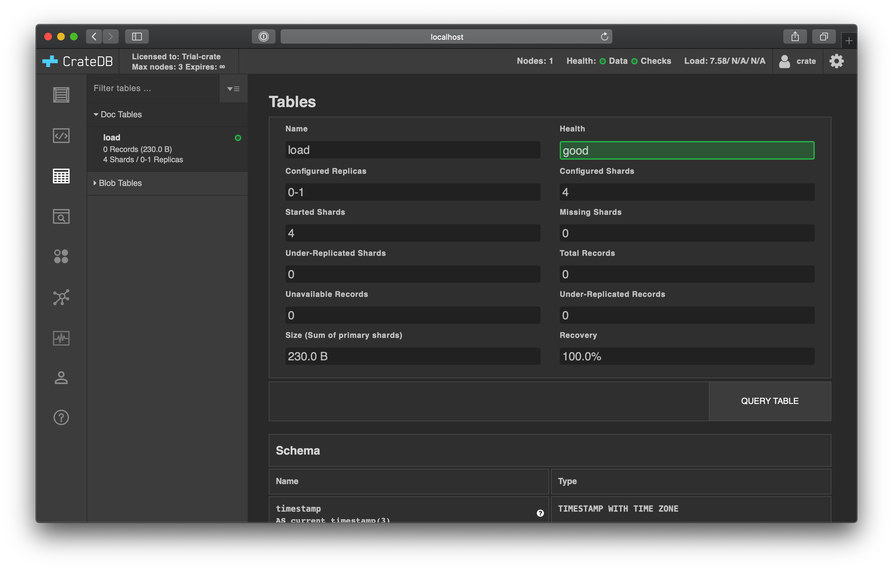
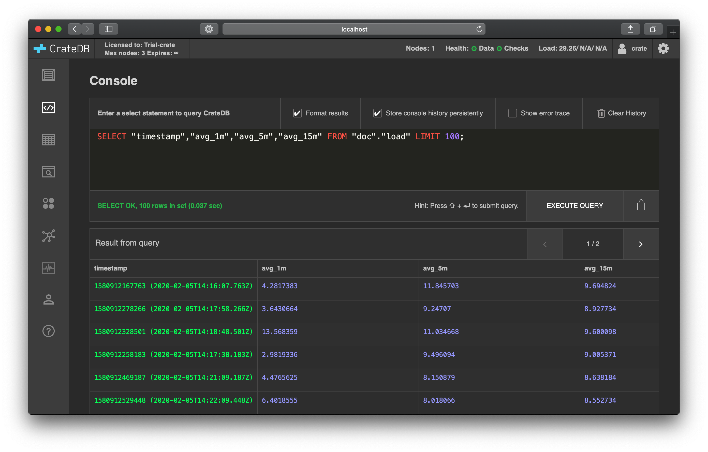

.. _gen-ts-python:

======================================
Generate time series data using Python
======================================

This tutorial will show you how to generate some :ref:`experimental time series
data <gen-ts>` by sampling your `system load`_ using `Python`_.

.. SEEALSO::

    :ref:`gen-ts`

.. rubric:: Table of contents

.. contents::
   :local:

Prerequisites
=============

CrateDB must be :ref:`installed and running <install-run>`.

Make sure you're running an up-to-date Python (we recommend 3.7 or higher).

Then, use `Pip`_ to install the `psutil`_ and  `crate`_ libraries:

.. code-block:: console

    $ pip install psutil crate

The rest of this tutorial is designed for Python's `interactive mode`_ so that
you can experiment with the commands as you see fit. The `standard
Python interpreter`_ works fine for this, but we recommend `IPython`_ for a more
user-friendly experience.

You can install IPython with Pip:

.. code-block:: console

    $ pip install ipython

Once installed, you can start an interactive IPython session like this:

.. code-block:: console

    $ ipython

Use Python to read your system load
===================================

Start an interactive Python session. Then, import the `psutil`_ library:

    >>> import psutil

Once imported, you can read the current system load averages with the
`getloadavg`_ function:

    >>> psutil.getloadavg()
    (4.59326171875, 4.56689453125, 5.150390625)

The function returns a tuple with three `floats`_ corresponding to the one
minute average, five-minute average, and 15-minute average.

Set up CrateDB
==============

First, import the `crate`_ client module:

    >>> from crate import client

Then, `connect`_ to CrateDB:

    >>> connection = client.connect("localhost:4200")

.. NOTE::

    You can omit the function argument if CrateDB is running on
    ``localhost:4200``. We have included it here for the sake of clarity.
    Modify the argument if you wish to connect to a CrateDB node on a different
    host or port number.

Get a `cursor`_:

    >>>  cursor = connection.cursor()

Then, finally, `create a table`_ suitable for writing load averages:

    >>> cursor.execute(
    ...     """CREATE TABLE load (
    ...            timestamp TIMESTAMP GENERATED ALWAYS AS CURRENT_TIMESTAMP,
    ...            avg_1m REAL,
    ...            avg_5m REAL,
    ...            avg_15m REAL)"""
    ... )

In the `CrateDB Admin UI`_, you should see the new table when you navigate to
the *Tables* screen using the left-hand navigation menu:

Record your system load
=======================

With the table in place, you can start recording load averages.

The following command calls `getloadavg`_ and uses the result tuple as `input
values`_ for the `INSERT`_ query:

    >>> cursor.execute(
    ...     "INSERT INTO load (avg_1m, avg_5m, avg_15m) VALUES (?, ?, ?)",
    ...     psutil.getloadavg(),
    ... )

Press the up arrow on your keyboard and hit *Enter* to run the same command a
few more times.

When you're done, you can `SELECT`_ that data back out of CrateDB, like so:

    >>> cursor.execute('SELECT * FROM load ORDER BY timestamp DESC')

Then, `fetch all`_ the result rows at once:

    >>> cursor.fetchall()
    [[1580670546270, 5.4072266, 4.788086, 4.620117],
     [1580670545367, 5.6171875, 4.8183594, 4.629883],
     [1580670478666, 4.411621, 4.578125, 4.54541]]

Here we have recorded three sets of load averages with a corresponding
timestamp.

Automate it
===========

Now we have the basics figured out, let's automate the data collection.

Copy the commands you used into a file named ``monitor-load.py``, like this:

.. code-block:: python

    import time

    import psutil
    from crate import client

    def insert():
        # New connection each time
        connection = client.connect("localhost:4200")
        print("CONNECT OK")
        cursor = connection.cursor()
        cursor.execute(
            "INSERT INTO load (avg_1m, avg_5m, avg_15m) VALUES (?, ?, ?)",
            psutil.getloadavg(),
        )
        print("INSERT OK")

    # Loop indefinitely
    while True:
        insert()
        print("Sleeping for 10 seconds...")
        time.sleep(10)

Here, the script sleeps for 10 seconds after each sample. Accordingly, the time
series data will have a *resolution* of 10 seconds. You may want to configure
your script differently.

Run it from the command line, like so:

.. code-block:: console

    $ python monitor-load.py
    CONNECT OK
    INSERT OK
    Sleeping for 10 seconds...
    CONNECT OK
    INSERT OK
    Sleeping for 10 seconds...
    CONNECT OK
    INSERT OK
    Sleeping for 10 seconds...

As this runs, you should see the table filling up in the CrateDB Admin UI:

Lots of freshly generated time series data, ready for use.

.. _connect: https://crate.io/docs/clients/python/en/latest/connect.html
.. _crate: https://crate.io/docs/clients/python/en/latest/
.. _CrateDB Admin UI: https://crate.io/docs/clients/admin-ui/en/latest/
.. _create a table: https://crate.io/docs/crate/reference/en/latest/general/ddl/create-table.html
.. _cursor: https://crate.io/docs/clients/python/en/latest/query.html#using-a-cursor
.. _fetch all: https://crate.io/docs/clients/python/en/latest/query.html#fetchmany
.. _floats: https://docs.python.org/3.9/tutorial/floatingpoint.html
.. _getloadavg: https://psutil.readthedocs.io/en/latest/#psutil.getloadavg
.. _input values: https://crate.io/docs/clients/python/en/latest/query.html#regular-inserts
.. _INSERT: https://crate.io/docs/crate/reference/en/latest/general/dml.html#inserting-data
.. _interactive mode: https://docs.python.org/3/tutorial/interpreter.html#interactive-mode
.. _interactive Python session: https://docs.python.org/3/tutorial/interpreter.html#interactive-mode
.. _Internet of Things: https://en.wikipedia.org/wiki/Internet_of_things
.. _IPython: https://ipython.org/
.. _Pip: https://pypi.org/project/pip/
.. _psutil: https://psutil.readthedocs.io/en/latest/
.. _Python: https://www.python.org/
.. _SELECT: https://crate.io/docs/crate/reference/en/latest/general/dql/selects.html
.. _standard Python interpreter: https://docs.python.org/3/tutorial/interpreter.html
.. _system load: https://en.wikipedia.org/wiki/Load_(computing)
.. _time series: https://en.wikipedia.org/wiki/Time_series
